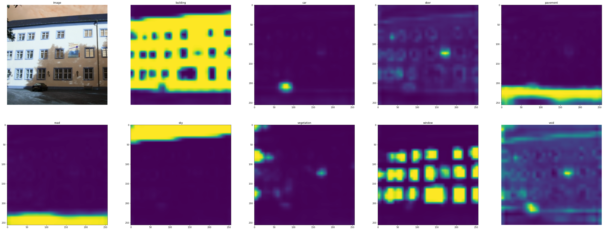

# finetuning deeplabv3 for multi-class semantic segmentation
This repository contains code for Fine Tuning [DeepLabV3 ResNet101](https://arxiv.org/abs/1706.05587) in PyTorch. The model is from the [torchvision module](https://pytorch.org/docs/stable/torchvision/models.html#semantic-segmentation).

I've fine tuned the model for the [eTRIMS Image Database](http://www.ipb.uni-bonn.de/projects/etrims_db/) data-set. I have used the eTRIMS Database beta 2, with 8 classes of objects(Building, Car, Door, Pavement, Road, Sky, Vegetation, Window) 

The model was fine tuned for 40 epochs and achieves an testing loss value of 0.859484.

The segmentation output of the model on a sample image are shown below.



Loss plot is shown below.


To run the code the dataset use the following command.

```
python main.py "data_directory_path" "experiment_folder_where weights and log file need to be saved"
```
It has following two optional arguments:
```
--epochs : Specify the number of epochs. Default is 25.
--batchsize: Specify the batch size. Default is 4.
```

# Citation
eTRIMS Image Database

@techreport{ korc-forstner-tr09-etrims,
             author = "Kor{\v c}, F. and F{\" o}rstner, W.",
             title = "{eTRIMS} {I}mage {D}atabase for Interpreting Images of Man-Made Scenes",
             number = "TR-IGG-P-2009-01",
             month = "April",
             year = "2009",
             institute = "Dept. of Photogrammetry, University of Bonn",
             url = "http://www.ipb.uni-bonn.de/projects/etrims_db/" }
